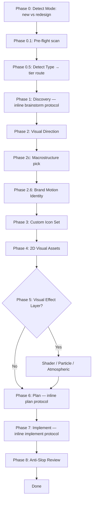

# Phase 05 — SKILL.md (v2.4.0 + Phase 2.6 + References + new files)

## Context links
- [brainstorm.md](./brainstorm.md) § Implementation considerations
- [phase-04-workflow-split.md](./phase-04-workflow-split.md) — depends on (new files referenced)
- [phase-01](./phase-01-foundation-refs.md), [phase-02](./phase-02-motion-personalities.md), [phase-03](./phase-03-macrostructure-hero-catalog.md) — depends on
- [SKILL.md](../../SKILL.md)

## Overview
- **Priority:** Final integration — SKILL.md is canonical entry, must accurately reflect all v2.4 changes
- **Status:** pending
- **Depends on:** Phase 01, 02, 03, 04 (all references must exist)
- **Parallel-safe with:** Phase 06 (different file)
- **Description:** Bump version 2.3.0 → 2.4.0. Add Phase 2c (Macrostructure pick) + Phase 2.6 (Brand Motion Identity) to Mermaid diagram. Update References table with 5 new files. Update Phase Method Map. Update Hard Rules with diversification concept.

## Key insights
- Mermaid diagram gets 2 new nodes (Phase 2c after 2b, Phase 2.6 after 2e)
- References table grows from 13 → 18 rows (5 new files)
- Phase Method Map adds Phase 2c, 2.6, and updates Phase 1/6/7/8 to point at sub-files
- Hard Rules: may add new Hard Rule #10 for Diversification OR fold into Hard Rule #9 (Type-aware)

## Requirements

### Functional
- SKILL.md frontmatter `version: "2.4.0"`
- Mermaid diagram has Phase 2c (Macrostructure pick) + Phase 2.6 (Brand Motion Identity) nodes
- References table adds 5 new rows: macrostructure-catalog.md + 4 workflow sub-files
- Phase Method Map adds rows for 2c + 2.6
- Phase Method Map rows for 1/6/7/8 updated to reference sub-files (workflow-brainstorm/plan/implement/audit)
- Hard Rule update: diversification mentioned (either new Hard Rule #10 or folded into existing rule)

### Non-functional
- Existing Hard Rules / Scope / Anti-Rationalization content preserved
- Trigger phrases preserved (activation breadth unchanged)
- Frontmatter description: keep activation keywords; add brief mention of macrostructure / diversification

## Architecture

### Frontmatter version + description

```yaml
metadata:
  author: dris1153
  version: "2.4.0"
```

Description optional addition (concise, preserves activation): mention "macrostructure layer for structural variety" OR keep description unchanged and let README + Hard Rules carry the news.

### Mermaid diagram updates

Existing flow has nodes for Phase 0, 0.1, 0.5, 1, 2 (visual direction), 3, 4, 5, 6, 7, 8.

Add 2 new nodes after Phase 2 (Visual Direction):
- `C[Phase 2: Visual Direction]` → `MC[Phase 2c: Macrostructure pick]` → `BM[Phase 2.6: Brand Motion Identity]` → `D[Phase 3: Custom Icon Set]`

Updated Mermaid:


### References table update

Existing 13 rows + 5 new rows:

```markdown
| Macrostructure catalog (7 page-shape archetypes — Marquee Hero / Bento Grid / Long Document / Manifesto / Stat-Led / Workbench / Letter) | `references/macrostructure-catalog.md` |
| Workflow — Phase 1 brainstorm protocol | `references/workflow-brainstorm.md` |
| Workflow — Phase 6 plan protocol | `references/workflow-plan.md` |
| Workflow — Phase 7 implement protocol | `references/workflow-implement.md` |
| Workflow — Phase 8 audit protocol | `references/workflow-audit.md` |
```

### Phase Method Map updates

Existing rows for Phase 0.1, 1, 2 (a-e), 3, 4, 5, 6, 7, 8 + add:

```markdown
| 2c | Macrostructure pick (see `references/macrostructure-catalog.md`) | Type-independent page shape (one of 7 macros); diversification check against `.perfect-ui/log.json` |
| 2.6 | Brand Motion Identity (see `references/motion-patterns.md` § Motion Personalities) | Lock 3 motion constants — signature easing + duration palette + entrance pattern |
```

Also update existing Phase 1/6/7/8 rows to point at sub-files:

```markdown
| 1 | Inline brainstorm protocol (see `references/workflow-brainstorm.md`) | Vibe + type-branched brief |
| 6 | Inline plan protocol (see `references/workflow-plan.md`) | Type-aware implementation plan |
| 7 | Inline implement protocol (see `references/workflow-implement.md`) | Build the site |
| 8 | Inline tier-filtered audit (see `references/workflow-audit.md`) | Anti-slop audit |
```

### Hard Rules update (option A — fold into Hard Rule #9)

Hard Rule #9 currently: "Type-aware where it matters — landing/portfolio (special tier) use rich type-specific anatomy + skeleton..."

Updated to include diversification:

```markdown
9. **Type-aware + Diversification** — landing/portfolio (special tier) use rich type-specific anatomy + skeleton + per-vibe section archetypes; every other type (generic tier) uses generic anatomy + skeleton. Macrostructure pick (Phase 2c) must differ from last 3 entries in `.perfect-ui/log.json` (hard rule). Vibe + dial + motion personality should differ from last entry (soft warnings). See `references/macrostructure-catalog.md § Diversification rule`.
```

OR add Hard Rule #10 (cleaner separation):

```markdown
10. **Diversify across runs** — for projects with prior perfect-ui builds, macrostructure pick must NOT match any of the last 3 entries in `.perfect-ui/log.json` (hard rule). Vibe / dials / motion personality should differ from last entry (soft warnings, override OK). See `references/macrostructure-catalog.md § Diversification rule`.
```

Recommendation: **Add Hard Rule #10** (cleaner separation; preserves Hard Rule #9 type-aware focus).

### Process Flow node label updates

Existing process flow has node labels for Phase 1, 6, 7, 8 mentioning "Inline brainstorm protocol" etc. Update to point at sub-files in node labels OR leave as-is and rely on Phase Method Map for cross-refs.

Recommendation: leave Mermaid labels concise; Phase Method Map handles sub-file cross-refs.

## Related code files

**Modify:** `SKILL.md` (single file, multiple sections)

**Create / Delete:** None

## Implementation steps

1. **Verify Phase 01-04 complete** (cross-references must resolve)
2. **Update SKILL.md frontmatter version** → "2.4.0"
3. **Update Mermaid diagram** — add MC (Phase 2c) + BM (Phase 2.6) nodes between C (Phase 2) and D (Phase 3)
4. **Update References table** — add 5 new rows (macrostructure-catalog + 4 workflow sub-files)
5. **Update Phase Method Map** — add 2c + 2.6 rows; update Phase 1/6/7/8 to reference sub-files
6. **Add Hard Rule #10** for Diversification (recommended) OR fold into #9
7. **Verify mermaid syntax** (markdown preview if available)
8. **Verify all cross-references** resolve

## Todo list
- [ ] Verify Phase 01-04 complete
- [ ] Update frontmatter version → 2.4.0
- [ ] Update Mermaid diagram (Phase 2c + 2.6 nodes)
- [ ] Update References table (+5 rows)
- [ ] Update Phase Method Map (+2 new rows; +update 4 existing rows for sub-files)
- [ ] Add Hard Rule #10 (Diversification) OR fold into #9
- [ ] Verify Mermaid syntax
- [ ] Final cross-reference check

## Success criteria
- SKILL.md frontmatter version = 2.4.0
- Mermaid has 2c + 2.6 nodes
- References table has 5 new entries
- Phase Method Map updated (2 new + 4 modified rows)
- Hard Rule #10 (or #9 update) covers Diversification rule
- All file references resolve

## Risk assessment
- **Risk:** Mermaid syntax breaks after adding nodes → validate post-edit with markdown preview
- **Risk:** References table becomes too long (18 rows) → still scannable; group by concern if needed
- **Risk:** Phase Method Map rows for sub-files diverge from sub-file content → use exact sub-file names + path; verify post-edit
- **Risk:** Hard Rule #10 vs #9 fold ambiguity → user can decide in flight; default add #10 (cleaner)

## Security considerations
None.

## Next steps
- Phase 06 README + index.html document v2.4.0 changes
- Final verification: grep v2.4.0 in 4 locations
