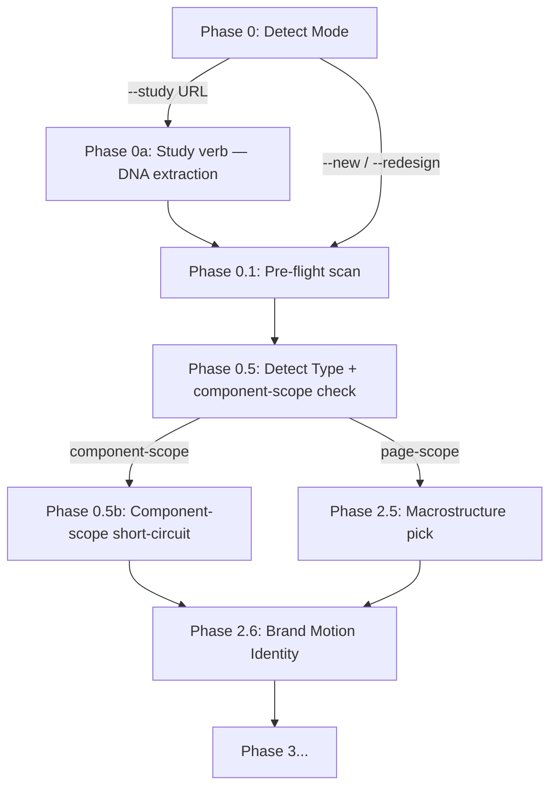

# Phase 05 — Public surfaces (SKILL.md v2.5.0 + README + index.html)

## Context links
- [brainstorm.md](./brainstorm.md) § File-level impact summary
- [phase-01](./phase-01-study-mode.md), [phase-02](./phase-02-component-scope.md), [phase-03](./phase-03-preemit-gate.md), [phase-04](./phase-04-workflow-routing.md) — depends on (all)
- SKILL.md, README.md, index.html

## Overview
- **Priority:** Final integration — version bump + Hard Rule #11 + public docs
- **Status:** pending
- **Depends on:** Phase 01-04 (all references must exist)
- **Description:** Bump version 2.4.1 → 2.5.0. Add SKILL.md Hard Rule #11 (Pre-emit verification) + Mermaid +2 nodes + References table +3 rows + Phase Method Map +3 rows + Anti-Rationalization rows. Add README v2.5.0 paragraph + 3 new FAQ + credits. Update index.html hero + footer + 2 Pipeline cards + Mandate update.

## Key insights
- v2.5.0 = FINAL roadmap cycle — Hard Rule #11 is last new Hard Rule
- Mermaid gets 2 new nodes (Phase 0 --study branch, Phase 0.5 component-scope branch)
- References table grows from 18 → 21 rows (3 new ref files)
- README v2.5.0 paragraph + 3 new FAQ (1 per item — Study verb / Component-scope / Pre-emit verification)
- index.html adds 2 new Pipeline cards (--study, component-scope) + Mandate #10 (Pre-emit verification)

## Requirements

### Functional
- SKILL.md frontmatter `version: "2.5.0"`
- Mermaid +2 nodes (Phase 0 --study branch, Phase 0.5 component-scope branch)
- References table +3 rows (study-mode + component-scope + preemit-design-plan)
- Phase Method Map +3 rows (Study mode / Component-scope / Pre-emit verification)
- Hard Rule #11 NEW (Pre-emit verification)
- Anti-Rationalization +3 rows
- README.md L5 v2.5.0 + v2.5.0 paragraph + 3 new FAQ + credits (Hallmark study + Hallmark component-scope + gpt-taste design_plan)
- index.html hero + footer v2.5.0 + 2 Pipeline cards + Mandate #10

### Non-functional
- Trigger phrases preserved
- Backward compat: existing Examples render schema-identically
- Anti-slop self-audit: no violations introduced

## Architecture

### SKILL.md edits

1. **Frontmatter version**: `version: "2.5.0"`

2. **Mermaid diagram — add 2 nodes** (Phase 0 branch + Phase 0.5 branch):


3. **References table — add 3 rows**:
```markdown
| Study mode (extract DNA from reference URL — diagnosis + 3-way branch) | `references/study-mode.md` |
| Component-scope branch (single UI element output — 8-state preview wrapper) | `references/component-scope.md` |
| Pre-emit `<design_plan>` verification block (10-field Phase 7 entry gate) | `references/preemit-design-plan.md` |
```

4. **Phase Method Map — add 3 rows**:
```markdown
| 0a | Study mode (see `references/study-mode.md`) — extract DNA from URL, emit diagnosis, 3-way branch | When `--study <URL>` flag passed |
| 0.5b | Component-scope detection (see `references/component-scope.md`) — multi-signal routing | Auto-detect at Phase 0.5; 2+ signals confirm |
| 7-entry | Pre-emit `<design_plan>` verification (see `references/preemit-design-plan.md`) — 10-field gate | Runs before any code emission |
```

5. **Hard Rule #11 NEW**:
```markdown
11. **Pre-emit verification (v2.5.0+)** — at Phase 7 entry, BEFORE any code emission, run the `<design_plan>` 10-field verification block (see `references/preemit-design-plan.md`). All 10 fields must pass (macrostructure_diversification / vibe_validity / dial_alignment / motion_personality / hero_math / bento_density / label_sweep / button_contrast / honest_copy / gsap_decision). Collect-all-errors approach: user fixes once, re-runs gate. Component-scope runs minimal 4-field subset (vibe / motion / button_contrast / honest_copy). Block stamped in CSS comment + `plans/{date}-{slug}/plan.md § Pre-emit verification`.
```

6. **Anti-Rationalization +3 rows**:
```markdown
| "Just paste URL and copy the design" | NO. Use `--study <URL>` to extract DNA (structural patterns), generate diagnosis. Never pixel-copy. See `references/study-mode.md`. |
| "User said 'design a button' — make a whole landing page anyway" | NO. Component-scope auto-detect skips page-level apparatus. See `references/component-scope.md`. |
| "Skip the pre-emit block, I already know the design is right" | NO. Pre-emit verification catches drift between Phase 1-6 locked picks and Phase 7 intended implementation. Mandatory gate. |
```

### README.md edits

1. **L5 version**: `**Version:** 2.5.0`

2. **v2.5.0 paragraph** (after v2.4.1 paragraph):
```markdown
**v2.5.0 update (FINAL roadmap cycle):** New Modes pass. Three new features close out the 3-version Tier 3 roadmap. (1) Study verb (`--study <URL>`) extracts structural DNA — macrostructure / type-pair / accent OKLCH / nav archetype — from a reference URL, generates one-page diagnosis report, offers 3-way branch (build with DNA / lock to portable `design.md` / stop at diagnosis). Borrowed from Hallmark. (2) Component-scope branch auto-detects when brief = 1 UI element (multi-signal: brief ≤30 words + element keyword + `--component` flag); collapses page-level apparatus, emits component + standalone `.preview.*` 8-state wrapper (default / hover / focus / active / disabled / loading / error / success). (3) Pre-emit `<design_plan>` verification block (Hard Rule #11) runs at Phase 7 entry as 10-field gate (macrostructure / vibe / dials / motion personality / Hero math / Bento density / Label sweep / Button contrast / Honest copy / GSAP decision) — catches drift between locked picks and intended implementation. Borrowed from gpt-taste structured plan output.
```

3. **3 new FAQ entries** (insert near end of FAQ — one per item):

```markdown
**Q: How does Study mode work (v2.5.0+)?**
A: Pass `--study <URL>` to extract structural DNA from a reference page — display + body fonts, paper + accent OKLCH, macrostructure (inferred), nav + footer archetypes. Skill generates one-page diagnosis report identifying patterns + anti-patterns. Then 3-way branch: (a) build with DNA (Phase 1 brief uses extracted DNA as locked inputs); (b) lock the DNA (emit portable `design.md` for project reuse); (c) stop (diagnosis IS deliverable). URL safety refusal list blocks template marketplaces, dribbble shots, etc. Falls back to screenshot if URL auth-walled or SPA shell. Studied-DNA runs suspend diversification rule. See `references/study-mode.md`.

**Q: When does Component-scope mode activate (v2.5.0+)?**
A: Auto-detect at Phase 0.5 via multi-signal logic: brief mentions single UI element (button / card / modal / dropdown / etc.) + brief ≤30 words + explicit `--component` flag. 2+ signals confirm component scope. Skill skips page-level apparatus (macrostructure pick, nav/footer archetypes, hero enrichment, project memory log) and emits 2 files: component artifact (Button.tsx / Card.vue / etc.) + standalone `.preview.*` 8-state wrapper (default / hover / focus / active / disabled / loading / error / success). Preview wrapper extension auto-detects framework from pre-flight scan. See `references/component-scope.md`.

**Q: What's the `<design_plan>` pre-emit gate (v2.5.0+)?**
A: At Phase 7 entry, BEFORE any code emission, skill runs a structured 10-field verification block. Fields: macrostructure_diversification / vibe_validity / dial_alignment / motion_personality / hero_math / bento_density / label_sweep / button_contrast / honest_copy / gsap_decision. Many fields auto-verifiable (no user prompt). Collect-all-errors approach: user fixes once, re-runs gate. Catches drift between Phase 1-6 locked picks and Phase 7 intended implementation BEFORE it ships. Component-scope runs minimal 4-field subset. Block stamped in CSS comment + `plans/{date}-{slug}/plan.md § Pre-emit verification`. Hard Rule #11. See `references/preemit-design-plan.md`.
```

4. **Credits acknowledge update**:
```markdown
- v2.5.0 Study verb adapted from Hallmark's `study` verb (URL DNA extraction + diagnosis + 3-way branch)
- v2.5.0 Component-scope branch adapted from Hallmark's component-scope detection + 8-state preview wrapper
- v2.5.0 Pre-emit `<design_plan>` block adapted from gpt-taste's mandatory structured plan output
```

### index.html edits

1. **Hero version**: `<span>v2.5.0</span>`
2. **Footer version**: `<span><em>perfect-ui</em> — v2.5.0</span>`

3. **Pipeline section — add 2 cards** (Phase 0a + Phase 0.5b):

```html
<div class="phase">
  <span class="phase-num">— 00a</span>
  <h3>Study mode</h3>
  <p>Pass <code>--study &lt;URL&gt;</code> to extract DNA from reference page. Diagnosis report + 3-way branch: build with DNA / lock to design.md / stop.</p>
  <span class="ref">study-mode.md</span>
</div>

<div class="phase">
  <span class="phase-num">— 00.5b</span>
  <h3>Component-scope</h3>
  <p>Brief = 1 UI element? Skill emits component + standalone 8-state preview wrapper. Skips page-level apparatus.</p>
  <span class="ref">component-scope.md</span>
</div>
```

4. **Mandate #10 NEW (Pre-emit verification)**:

```html
<div class="mandate">
  <span class="mandate-num">— 10</span>
  <h3>Pre-emit verification</h3>
  <p>Phase 7 entry runs 10-field <code>&lt;design_plan&gt;</code> block (macrostructure / vibe / dials / motion / Hero math / Bento / Label / Button / Honest copy / GSAP). All must pass before code emits.</p>
</div>
```

## Related code files

**Modify (3 files):**
- `SKILL.md` (frontmatter version + Mermaid +2 nodes + References table +3 rows + Phase Method Map +3 rows + Hard Rule #11 + Anti-Rationalization +3 rows)
- `README.md` (L5 version + v2.5.0 paragraph + 3 new FAQ + credits)
- `index.html` (hero + footer version + 2 Pipeline cards + Mandate #10)

**Create / Delete:** None

## Implementation steps

1. **Verify Phase 01-04 complete** (cross-references must resolve)
2. **Update SKILL.md frontmatter version** → "2.5.0"
3. **Update Mermaid diagram** — add `--study` branch + component-scope branch
4. **Add SKILL.md References table rows** (+3)
5. **Add SKILL.md Phase Method Map rows** (+3)
6. **Add SKILL.md Hard Rule #11** (Pre-emit verification)
7. **Add SKILL.md Anti-Rationalization rows** (+3)
8. **Update README.md L5 version** → 2.5.0
9. **Append v2.5.0 paragraph** to existing changelog
10. **Insert 3 new FAQ entries** (Study mode / Component-scope / Pre-emit verification)
11. **Update credits acknowledge** (3 new lines)
12. **Update index.html hero + footer** → v2.5.0
13. **Add 2 new Pipeline cards** (Phase 0a + Phase 0.5b)
14. **Add Mandate #10** (Pre-emit verification)
15. **Final verification:**
    - Grep `v?2\.5\.0` → ≥4 matches across 3 files
    - Grep `v?2\.4\.1` in SKILL.md / README.md / index.html → 0 stale matches (excluding historical changelog)
    - Verify Mermaid syntax intact
    - Smoke test: README Example 1 (coffee landing, `--new`, page-scope) flow unchanged

## Todo list
- [ ] Verify Phase 01-04 complete
- [ ] Update SKILL.md frontmatter version → 2.5.0
- [ ] Update Mermaid +2 nodes (Phase 0 --study, Phase 0.5 component-scope)
- [ ] Add References +3 rows
- [ ] Add Phase Method Map +3 rows
- [ ] Add Hard Rule #11 (Pre-emit verification)
- [ ] Add Anti-Rationalization +3 rows
- [ ] Update README L5 version → 2.5.0
- [ ] Append v2.5.0 paragraph
- [ ] Insert 3 new FAQ entries
- [ ] Update credits acknowledge
- [ ] Update index.html hero version
- [ ] Update index.html footer version
- [ ] Add 2 Pipeline cards (Phase 0a + Phase 0.5b)
- [ ] Add Mandate #10
- [ ] Final grep + Mermaid verification + smoke test

## Success criteria
- Version 2.5.0 in 4 locations (SKILL frontmatter + README L5 + index hero + index footer)
- SKILL.md Mermaid +2 nodes (--study, component-scope)
- SKILL.md References +3 rows
- SKILL.md Phase Method Map +3 rows
- SKILL.md Hard Rule #11 NEW
- SKILL.md Anti-Rationalization +3 rows
- README v2.5.0 paragraph + 3 new FAQ + credits
- index.html hero + footer v2.5.0 + 2 Pipeline cards + Mandate #10
- 0 stale v2.4.1 references in critical locations
- Backward compat: Existing Examples render schema-identically

## Risk assessment
- **Risk:** Hard Rule #11 added makes total 11 rules — table layout may need adjustment → acceptable; 11 rules still scannable
- **Risk:** Mermaid +2 nodes increases diagram complexity → use branching nodes (--study branch, component-scope branch) for clarity
- **Risk:** index.html Pipeline section grows to 12+ cards → still grid-friendly; layout auto-handles
- **Risk:** README v2.5.0 paragraph too long → keep concise multi-topic single paragraph
- **Risk:** v2.5.0 = final roadmap cycle — review fatigue from cumulative v2.3-v2.5 changes → user can roll back per cycle if needed (each cycle backward compat)

## Security considerations
None — markdown / HTML edits.

## Next steps
- Plan-level final verification (per plan.md § Final verification)
- Update plan.md status → completed
- All 5 phase rows → completed
- User reviews diff, commits manually per CLAUDE.md "No auto-commit"
- Optional: invoke /ck:journal for v2.5.0 FINAL roadmap cycle summary
